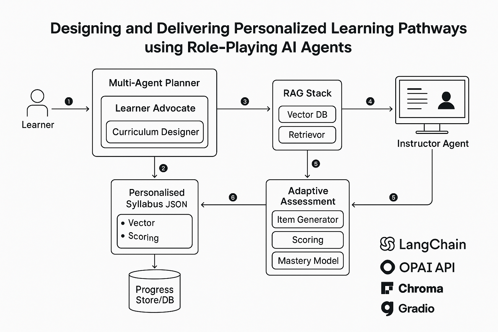

# LearnX
**MSc Project: Designing and Delivering Personalised Learning Pathways using Role-Playing AI Agents**

LearnX is a model-agnostic personalized learning platform that implements core components based on the [EduGPT](https://github.com/hqanhh/EduGPT) framework while significantly extending it with multi-model support, retrieval-augmented generation, and rigorous evaluation. The system creates a multi-agent "AI Educator" that can:
1. Generate a personalised syllabus from learner goals using role-playing agents.
2. Deliver lessons through an instructor agent with **retrieval-augmented generation (RAG)** for grounded, source-based teaching.
3. Provide **adaptive assessment** that adjusts difficulty and pacing based on learner performance.
4. Maintain a learner model to track mastery and guide ongoing pathway adaptation.
5. Support multiple LLMs (commercial and open-source) with cost-effectiveness analysis.  


## ✨ Features (Implemented)
- **Multi-Model Support** – Flexible architecture supporting GPT-4o-mini, GPT-3.5-Turbo, and open-source Mistral 7B with cost-effectiveness analysis.
- **Multi-Agent Syllabus Planner** – Learner advocate + curriculum designer agents negotiate and output a structured, validated syllabus with prerequisite checking.
- **Retrieval-Augmented Teaching** – RAG instructor agent delivers lessons using external resources with source citations and context-grounded responses.
- **Adaptive Assessment System** – Dynamic difficulty adjustment aligned with Bloom's taxonomy, points-weighted scoring, and LLM-based grading for open-ended questions.
- **Learner Profile & Progress Tracking** – Dynamic learner model with mastery levels, knowledge state, and performance analytics.
- **Session State Management** – Persistent session tracking with atomic file writes, pathway navigation (advance/remediation), and resume capability.
- **Scientific Evaluation Framework** – Learning gain metrics (Hake's normalized gain), A/B testing framework, and statistical analysis capabilities.
- **Production-Ready Infrastructure** – Schema validation, configuration management, comprehensive error handling, and 310+ automated tests.  

## System Architecture
The diagram below shows the overall workflow of the AI Educator system, from learner input through syllabus generation, lesson delivery with retrieval-augmented generation, adaptive assessment, and continuous feedback loops.  



## 🚀 Getting Started  

### 1. Clone the repository
```bash
git clone https://github.com/anasraza57/LearnX.git
cd LearnX
```

### 2. Set up a virtual environment
Python 3.11 is required.
```bash
# Create the environment and install the exact versions used for the experiments
make venv

# Or by hand:
python3.11 -m venv .venv
source .venv/bin/activate  # On Windows: .venv\Scripts\activate
pip install -r requirements.lock.txt
```
`requirements.txt` lists the direct dependencies; `requirements.lock.txt` pins every
version and is what the evaluation ran on.

### 3. Configure API keys
Create a `.env` file in the root directory:
```bash
# Copy the example file
cp .env.example .env

# Edit with your OpenAI API key
OPENAI_API_KEY=your_key_here

# Optional: Choose your model (default: gpt-4o-mini)
OPENAI_MODEL=gpt-4o-mini
```
`.env.example` documents every setting, including the OpenAI-compatible endpoint for
local models, the deterministic sampling policy and request handling.

**Model Options:**
- `gpt-4o-mini` (default) - Best cost-performance ratio: $0.0034/student, 74.85% avg score
- `gpt-3.5-turbo` - Budget option: $0.0157/student, 69.04% avg score
- `gpt-4o` - Premium performance (higher cost)

### 4. Local Model Configuration (Optional - Free)

For **cost-free deployment** using open-source Mistral 7B locally:

#### Step 1: Install Ollama
```bash
# macOS/Linux
curl -fsSL https://ollama.ai/install.sh | sh

# Or download from: https://ollama.ai/
```

#### Step 2: Pull Mistral 7B model
```bash
ollama pull mistral
```

#### Step 3: Serve it with a large enough context window
The planning prompts exceed Ollama's default 4,096-token window, and the
OpenAI-compatible endpoint cannot raise it per request, so start the server with:
```bash
OLLAMA_CONTEXT_LENGTH=32768 ollama serve
```

#### Step 3: Configure LearnX to use Ollama
Update your `.env` file:
```bash
OPENAI_BASE_URL=http://localhost:11434/v1
OPENAI_MODEL=mistral
OPENAI_API_KEY=ollama  # Dummy key for local models
```

**Mistral 7B Performance:**
- Cost: $0/student (runs locally)
- Performance: 64.74% avg score, g=0.471
- Achieves 86.5% of GPT-4o-mini performance at zero cost
- Requires: ~8GB RAM, GPU recommended but optional

**Note:** Ollama automatically starts a local API server on port 11434 that's compatible with the OpenAI API format.

### 5. Run the interactive demo
```bash
python src/run.py
```

This launches a Gradio web interface at `http://127.0.0.1:7860` with 5 tabs:
- **Tab 1**: Create learner profile
- **Tab 2**: Generate personalized syllabus
- **Tab 3**: Interactive teaching with RAG
- **Tab 4**: Adaptive assessment
- **Tab 5**: Progress tracking & analytics


## 📖 Background & Evaluation
- **EduGPT**: A LangChain-based project where a learner and instructor agent role-play to generate a syllabus and deliver lessons.

- **LearnX**: Implements core components based on EduGPT while significantly extending the framework with retrieval grounding, adaptive assessment, learner modelling, and multi-model support to deliver a production-ready personalised learning experience.

- **Three-Model Evaluation**: Comprehensive comparison of GPT-4o-mini, GPT-3.5-Turbo, and Mistral 7B (N=90, 30 synthetic students per model) demonstrating:
  - GPT-4o-mini: 74.85% average score, g=0.631, $0.0034/student
  - GPT-3.5-Turbo: 69.04% average score, g=0.553, $0.0157/student
  - Mistral 7B: 64.74% average score, g=0.471, $0/student (86.5% of GPT-4o performance)

## 🏗️ Implementation Status

### ✅ Phase 1: Configuration & Validation
- Production configuration system with environment-based settings
- JSON Schema validation for all data models
- Comprehensive error handling and logging
- **Tests**: 20+ tests covering config loading and schema validation

### ✅ Phase 2: Learner Model
- Dynamic learner profile with goals, interests, prior knowledge
- Mastery tracking with concept-level granularity
- Progress analytics and adaptive difficulty recommendations
- **Tests**: 35+ tests for profile validation and analytics

### ✅ Phase 3: RAG Instructor
- **Automatic Multi-Source OER Content Fetching**:
  - Wikipedia articles for general knowledge
  - arXiv research papers for technical/scientific topics
  - YouTube video transcripts (optional)
  - AI-generated synthetic content as fallback
- Document ingestion with vector embeddings (ChromaDB)
- Context-aware lesson delivery with source citations
- Session persistence and teaching state management
- **Tests**: 40+ tests for retrieval, citation tracking, session handling, and OER fetching

### ✅ Phase 4: Adaptive Assessment
- Multi-difficulty question generation aligned with learning objectives
- Points-weighted scoring system for nuanced difficulty
- LLM-based grading for open-ended responses with detailed feedback
- Adaptive quiz sessions with real-time difficulty adjustment
- **Tests**: 55+ tests for generation, grading, and adaptive logic

### ✅ Phase 5: Orchestrator & Integration
- Complete learning pipeline from enrollment to completion
- Session state management with atomic persistence
- Pathway navigation (advance on success, remediate on failure)
- Citation and metrics tracking across teaching/assessment cycles
- Multi-agent syllabus planning with prerequisite validation
- **Tests**: 35+ tests for orchestration, integration, and end-to-end workflows

### ✅ Phase 6: Evaluation & Multi-Model Support
- Scientific evaluation metrics (Hake's normalized learning gain, retention rates, engagement)
- A/B testing framework for controlled experiments
- Multi-model architecture (OpenAI API + Ollama for local deployment)
- Comprehensive model comparison (GPT-4o-mini, GPT-3.5-Turbo, Mistral 7B)
- Cost-effectiveness analysis and performance benchmarking
- **Tests**: 125+ tests for evaluation metrics, A/B testing, and multi-model interfaces

**Total Test Coverage**: 310+ automated tests, all passing ✅

## 📂 Project Structure

```
LearnX/
├── src/
│   ├── agents/               # AI agents for teaching & assessment
│   │   ├── syllabus_planner.py     # Multi-agent syllabus generation
│   │   ├── rag_instructor.py       # RAG-based teaching agent
│   │   ├── assessment_generator.py # Adaptive question generation
│   │   └── grading_agent.py        # LLM-based grading
│   ├── models/               # Data models & state management
│   │   ├── learner_profile.py      # Learner model with mastery tracking
│   │   └── quiz_session.py         # Adaptive quiz state management
│   ├── utils/                # Utilities & infrastructure
│   │   ├── config.py               # Configuration management
│   │   └── validation.py           # JSON Schema validation
│   ├── experiment/           # Scenario-based evaluation harness
│   │   ├── scenarios.py            # Controlled learner scenarios (full factorial)
│   │   ├── corpus.py               # Corpus build, relevance labelling, indexing
│   │   ├── conditions.py           # Ablation conditions
│   │   ├── single_agent.py         # Single-agent baseline
│   │   └── runner.py               # Runs conditions over scenarios, writes records
│   ├── llm.py                # Chat model factory and usage instrumentation
│   ├── orchestrator.py       # Main pipeline orchestration
│   └── run.py                # Entry point
├── tests/
│   └── unit/                 # Comprehensive unit test suite
│       ├── test_config.py
│       ├── test_validation.py
│       ├── test_learner_model.py
│       ├── test_rag_instructor.py
│       ├── test_assessment_generator.py
│       ├── test_grading_agent.py
│       ├── test_quiz_session.py
│       ├── test_orchestrator.py
│       └── test_syllabus_planner.py
├── data/                     # Runtime data storage
│   ├── scenarios/            # Versioned scenario sets (experiment inputs)
│   ├── corpus/               # Corpus manifest, relevance labels, index report
│   ├── sessions/             # Session state persistence
│   └── profiles/             # Learner profile storage
├── results/                  # Experiment records, one JSON per run
├── schemas/                  # JSON Schema definitions
├── requirements.txt          # Direct dependencies
├── requirements.lock.txt     # Exact pinned environment
└── README.md
```

## 🔬 Scenario-based evaluation

The system is evaluated by running it over a fixed set of controlled learner
scenarios and recording what it produces. Scenarios are experimental inputs: they
fix the profile the system is given and produce no scores.

```bash
make scenarios                      # check the scenario set reproduces byte for byte
make corpus-fetch                   # fetch the corpus (once per corpus version)
make corpus-label                   # apply the relevance rule, writing labels for review
make corpus-index                   # rebuild the vector index from empty

make probe  MODEL=gpt-5.4-mini      # repeat one scenario to quantify residual variation
make e1     MODEL=gpt-5.4-mini ARGS="--workers 4"   # ablation across all conditions

# Any backend, including a local OpenAI-compatible server:
.venv/bin/python -m src.experiment.runner --experiment e2 --model mistral:7b \
    --base-url http://localhost:11434/v1
```

Each run writes `results/<experiment>/<model>/<condition>/<scenario>.json` holding the
syllabus as extracted and as finalised, the negotiation transcript, every response with
its retrieved passages, prompt and inline citations, every generated assessment item, and
per-call token usage, latency and cost. Runs resume where they stopped, and each record
records the model snapshot, the scenario set and corpus hashes, package versions and a
content hash of the code that produced it.

## 🧪 Testing

### Run All Tests
```bash
python -m unittest discover tests/unit -v
```

### Quick Test Suite (Recommended)
Run fast tests only:
```bash
pytest tests/unit/test_config.py tests/unit/test_validation.py tests/unit/test_learner_profile_validation.py tests/unit/test_rag_instructor.py tests/unit/test_assessment_generator.py tests/unit/test_grading_agent.py tests/unit/test_quiz_session.py tests/unit/test_assessment_schemas.py tests/unit/test_orchestrator.py tests/unit/test_syllabus_planner.py tests/unit/test_evaluation_metrics.py tests/unit/test_ab_testing.py --no-cov -q
```
**Result:** 250+ tests pass in < 5 seconds ✅

### Test Coverage
- **Configuration & Validation**: `test_config.py`, `test_validation.py`
- **Learner Profile**: `test_learner_model.py`, `test_learner_profile_validation.py`
- **RAG Instructor**: `test_rag_instructor.py`
- **Assessment System**:
  - `test_assessment_generator.py` - Question generation with Bloom's taxonomy alignment
  - `test_grading_agent.py` - LLM-based grading for open-ended responses
  - `test_quiz_session.py` - Adaptive quiz and points-weighted scoring
  - `test_assessment_schemas.py` - Schema validation for assessments and quiz sessions
- **Orchestration & Integration**:
  - `test_orchestrator.py` - Complete pipeline orchestration
  - `test_syllabus_planner.py` - Multi-agent syllabus generation
- **Evaluation & Analysis**:
  - `test_evaluation_metrics.py` - Learning gain, retention, engagement metrics
  - `test_ab_testing.py` - A/B testing framework and statistical analysis

### Run Specific Test Suites
```bash
# Learner profile tests
python -m unittest tests.unit.test_learner_model -v

# Assessment system tests
python -m unittest tests.unit.test_assessment_generator -v
python -m unittest tests.unit.test_grading_agent -v
python -m unittest tests.unit.test_quiz_session -v

# Schema validation tests
python -m unittest tests.unit.test_assessment_schemas -v
```
